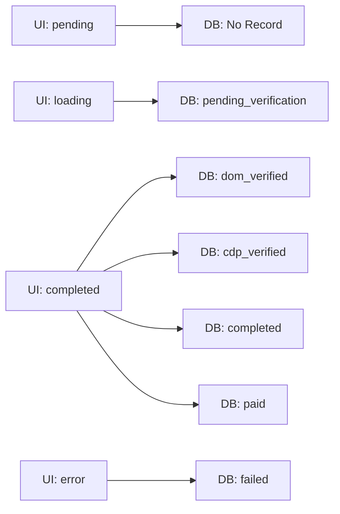

# Action State Mapping: UI ↔ Database

## State Mapping Overview



## Detailed State Mappings

### 1. UI State: `pending`
**Database State:** No record exists
- **Description:** Action is available but user hasn't clicked it yet
- **UI Display:** Empty circle or no icon
- **Database:** No `actionRuns` record
- **Code Location:** action-list-page.tsx:56-59

### 2. UI State: `loading` 
**Database State:** `pending_verification`
- **Description:** Action started, waiting for user to complete in browser
- **UI Display:** Spinning loader (Loader2 icon)
- **Database:** `actionRuns` record with `pending_verification` status
- **Code Location:** 
  - UI: action-list-page.tsx:60-63
  - DB Update: sidepanel/main.tsx:467-470 (set loading)
  - DB Create: action-runs.ts:50-64 (create with pending_verification)

### 3. UI State: `completed`
**Database States:** `dom_verified`, `cdp_verified`, `completed`, `paid`
- **Description:** Action verified by DOM tracking or further verification stages
- **UI Display:** Check mark icon
- **Database:** `actionRuns` record with one of:
  - `dom_verified` - User completed, DOM tracking confirmed
  - `cdp_verified` - Backend verified via Chrome DevTools Protocol
  - `completed` - All verifications passed
  - `paid` - Payment processed
- **Code Location:**
  - UI: action-list-page.tsx:64-67
  - DB Update: sidepanel/main.tsx:87-90 (set completed when action completes)
  - DB Update: sidepanel/main.tsx:98-109 (update to dom_verified)

### 4. UI State: `error`
**Database State:** `failed`
- **Description:** Action failed verification or had an error
- **UI Display:** X icon with error message
- **Database:** `actionRuns` record with `failed` status
- **Code Location:**
  - UI: action-list-page.tsx:68-71, 174-180
  - DB Update: sidepanel/main.tsx:115-122

## State Transition Flow

```typescript
// 1. Initial Click - UI sets loading, DB creates record
UI: pending → loading
DB: none → pending_verification

// 2. User Completes Action - DB updates, UI updates
UI: loading → completed
DB: pending_verification → dom_verified

// 3. Backend Verification (happens in background)
UI: completed (no change)
DB: dom_verified → cdp_verified

// 4. Final Verification
UI: completed (no change)
DB: cdp_verified → completed

// 5. Payment Processing (async)
UI: completed (no change)
DB: completed → paid

// Error Cases
UI: loading → error
DB: pending_verification → failed
```

## Code References

### UI State Management
**File:** `entrypoints/sidepanel/main.tsx`
```typescript
// State stored in React
const [actionStatuses, setActionStatuses] = useState<Record<string, ActionStatus>>({});

// Update on action click (line 467-470)
setActionStatuses(prev => ({
  ...prev,
  [actionId]: 'loading'
}));

// Update on completion (line 87-90)
setActionStatuses(prev => ({
  ...prev,
  [actionId]: success ? 'completed' : 'error'
}));
```

### Database State Management
**File:** `src/routes/action-runs.ts`
```typescript
// Create with initial state (line 50-64)
.insert(actionRuns)
.values({
  status: "pending_verification",
  // ...
})

// Update state (line 211-216)
.update(actionRuns)
.set({
  status: newStatus,
  updatedAt: new Date()
})
```

### State Synchronization Points

1. **Action Start** (sidepanel/main.tsx:473-487)
   - Creates DB record via API
   - Sets UI to loading
   - Stores actionRunId for tracking

2. **Action Completion** (sidepanel/main.tsx:83-127)
   - Receives message from background script
   - Updates DB via API
   - Updates UI state

3. **Resume Logic** (sidepanel/main.tsx:440-456)
   - Checks for existing DB record
   - Resumes with stored actionRunId
   - Maintains loading state

## State Persistence & Recovery

### Scenarios:

1. **Browser Crash During Action**
   - DB State: Remains in last known state (e.g., `pending_verification`)
   - UI State: Reset to `pending` on reload
   - Recovery: Check DB for incomplete runs, restore to `loading` if found

2. **Network Failure**
   - DB State: May be out of sync
   - UI State: Shows `error`
   - Recovery: Retry mechanism with idempotent API calls

3. **Extension Reload**
   - DB State: Preserved
   - UI State: Lost, needs reconstruction
   - Recovery: Fetch user's action runs on load

## API Endpoints Mapping

| Operation | Endpoint | DB State Change | UI State Change |
|-----------|----------|-----------------|-----------------|
| Start Action | POST /action-runs/start | none → pending_verification | pending → loading |
| Update Status | PATCH /action-runs/:id | any → new_status | loading → completed/error |
| Get User Runs | GET /action-runs/user/:userId | - | Restore states from DB |

## Key Invariants

1. **UI loading state** always corresponds to an active DB record
2. **UI completed state** only shows when DB status ≥ completed
3. **UI error state** always corresponds to DB failed status
4. **No duplicate active runs** - enforced by API (action-runs.ts:19-37)
5. **State transitions are unidirectional** except for error cases

## Testing State Mappings

```typescript
// Test cases to verify state consistency
describe('Action State Mapping', () => {
  it('UI pending has no DB record', () => {
    // No actionRuns entry should exist
  });
  
  it('UI loading has active DB record', () => {
    // actionRuns.status IN ('pending_verification', 'dom_verified', 'cdp_verified')
  });
  
  it('UI completed has completed DB record', () => {
    // actionRuns.status IN ('completed', 'paid')
  });
  
  it('UI error has failed DB record', () => {
    // actionRuns.status = 'failed'
  });
});
```