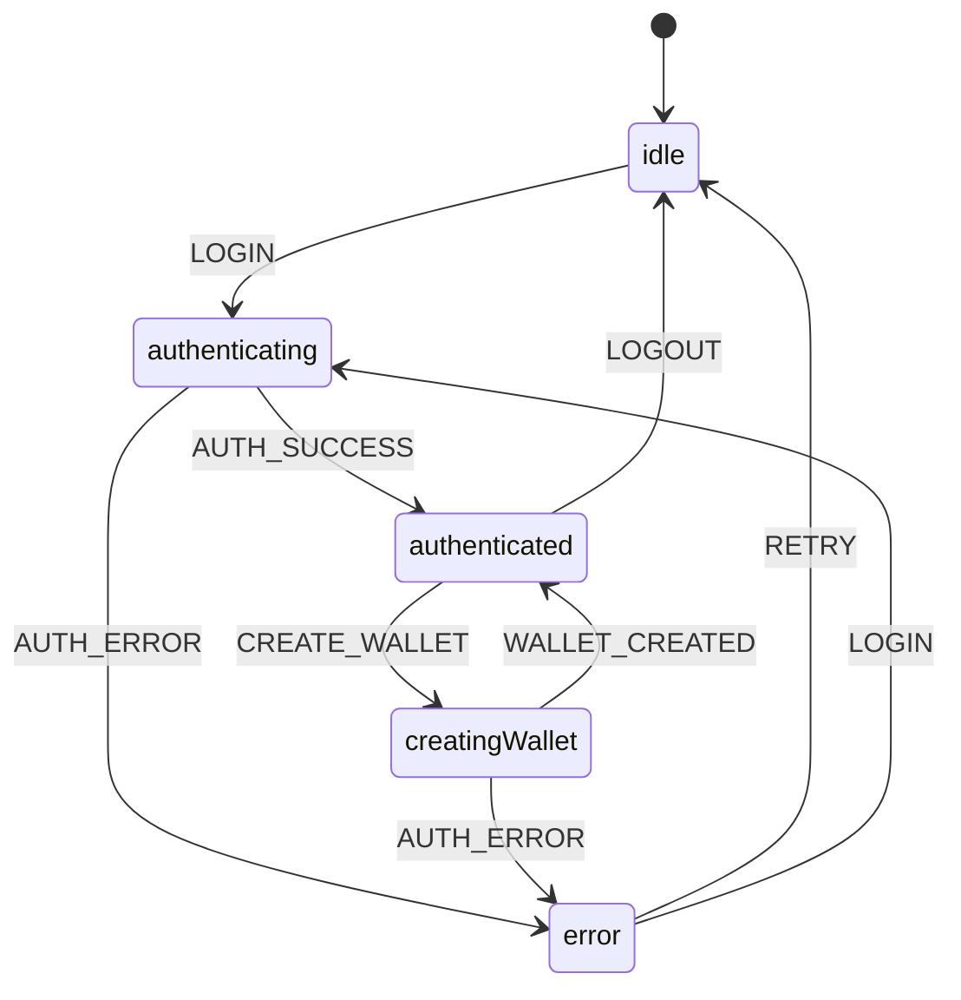

# State Layer Documentation

## Overview

This state layer implements a TDD-driven, XState-powered authentication system for Privy integration in the WXT extension. The implementation follows the Red-Green-Refactor methodology and provides a clean separation between state management and UI concerns.

## Architecture

```
src/state/
├── docs/                      # Documentation
│   ├── README.md             # This file
│   ├── api.md                # API documentation  
│   ├── testing.md            # Testing guide
│   └── examples.md           # Usage examples
├── machines/                  # XState machines
│   ├── privyAuthMachine.ts   # Main auth state machine
│   └── __tests__/            # Machine tests
└── types/                    # TypeScript types (in parent types/ folder)
```

## Key Components

### 1. State Machine (`machines/privyAuthMachine.ts`)
- **Technology:** XState v5
- **Pattern:** Finite State Machine
- **States:** idle, authenticating, authenticated, creatingWallet, error
- **Context:** User data, wallets, errors, signed messages

### 2. Services Layer (`../services/`)
- **PrivyService:** Privy API integration abstraction
- **StateStorage:** Chrome extension storage persistence
- **Pattern:** Static service classes with error handling

### 3. React Integration (`../hooks/`)
- **usePrivyAuthMachine:** Main hook for React components
- **Features:** Auto-persistence, lifecycle management, error handling

## State Flow



## Testing Strategy

### TDD Implementation
The entire state layer was built using Test-Driven Development:

1. **Red Phase:** Write failing tests first
2. **Green Phase:** Implement minimal code to pass tests
3. **Refactor Phase:** Optimize and clean up code

### Test Coverage
- **56 total tests** across 4 test suites
- **100% passing** test rate
- **Unit tests** for each component
- **Integration tests** for the complete flow

### Test Structure
```
__tests__/
├── privyAuthMachine.test.ts    # State machine tests (15 tests)
├── privyService.test.ts        # Service layer tests (16 tests)  
├── stateStorage.test.ts        # Storage tests (15 tests)
└── usePrivyAuthMachine.test.tsx # Hook tests (10 tests)
```

## Dependencies

### Production
- `xstate`: ^5.21.0 - State machine library
- `@xstate/react`: ^6.0.0 - React integration
- `react`: ^19.1.1 - React framework

### Development  
- `vitest`: ^3.2.4 - Testing framework
- `@testing-library/react`: ^16.3.0 - React testing utilities
- `@testing-library/jest-dom`: ^6.8.0 - DOM testing matchers
- `jsdom`: ^26.1.0 - DOM simulation for tests

## Key Benefits

### 1. Predictable State Management
- Explicit state transitions prevent invalid states
- All state changes are traceable and debuggable
- XState DevTools integration for visualization

### 2. Comprehensive Testing
- TDD approach ensures robust implementation
- High test coverage prevents regressions
- Mocked dependencies for isolated testing

### 3. Chrome Extension Integration
- Automatic state persistence across sessions
- Chrome storage API abstraction
- Error handling for storage quota/permission issues

### 4. Clean Architecture
- Separation of concerns between state, services, and UI
- Service layer abstracts Privy SDK complexity
- Hook-based API for React component integration

### 5. Error Resilience
- Built-in error states and recovery mechanisms
- Graceful degradation on service failures
- User-friendly error messages

## Performance Considerations

- **Lazy Loading:** Services are imported dynamically where possible
- **State Persistence:** Only authenticated states are persisted
- **Memory Management:** XState handles cleanup automatically
- **Chrome Storage:** Efficient key-based storage with minimal data

## Security Considerations

- **No Sensitive Data:** Private keys never stored in state
- **Storage Encryption:** Chrome storage is encrypted at rest
- **Input Validation:** All inputs validated before processing
- **Error Sanitization:** Error messages don't leak sensitive info

## Future Enhancements

- Multi-wallet support
- Biometric authentication
- Cross-tab state synchronization
- Advanced error analytics
- State machine visualization tools

---

*Generated with TDD methodology following the Red-Green-Refactor cycle*